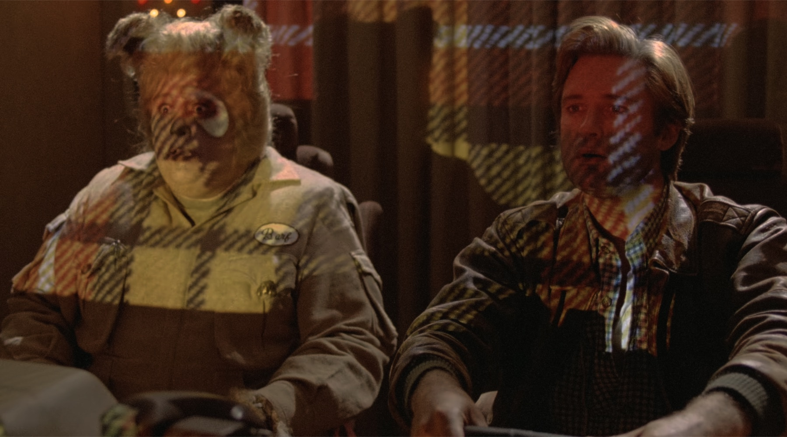

# Fixed3D: Box3D in Q48.16 fixed point

[](https://github.com/mas-bandwidth/fixed3d/actions)

If this work helps you, please support it: **[Become a supporter](https://www.patreon.com/MasBandwidth/membership)**



This fork exists to answer two questions:

1. **What would [Box3D](https://github.com/erincatto/box3d) look like if it
   was *entirely* fixed point?**
2. **Exactly how much slower would it be?**

The answers: This repository and currently about **2.2× float runtime in scalar mode**,
or **2.1× with NEON**, measured over the full benchmark suite on Apple M3 Ultra.

What you get in exchange is one thing: a truly huge world with uniform precision everywhere.

That trade is narrower than it sounds, and **you should probably keep using
Box3D** — see [Should I use this?](#should-i-use-this) for the honest
comparison.

## What is this

Box3D with every `float` torn out of the simulation and replaced with **Q48.16
fixed point** in an `int64_t`. All of it: the solver, GJK, the trig, the ray
casts, the mass properties, the recording format. The float SIMD is gone (it
grew back on AVX-512 and NEON — same bits, just faster). In
exchange, resolution is a uniform 1/65536 everywhere in a ±1.4×10¹⁴ meter
world, every step is still bit-exact on every platform (Box3D already
was — see below), and all 24 unit test suites still pass.

## Profile results: fixed point vs. single precision floating point

Measured 2026-09-07 on Apple M3 Ultra, macOS 26.6.2, Apple Clang 21,
RelWithDebInfo (`-O2`, thin LTO), four workers, continuous collision enabled.
The table uses median whole-scene runtimes from alternating processes;
commands, all trials, binary hashes and rechecks are in the
[measurement record](benchmark/2026-09-07-contact-joint-performance.md).

- **Float:** Box3D `47d7f7c`, single precision with default NEON.
- **Fixed:** this tree with fixed `2f1ed91`, scalar defaults.
- **Fixed+NEON:** the same tree with `-DBOX3D_NEON=ON` (narrow phase).

| Benchmark | Float (ms) | Fixed (ms) | Fixed+NEON (ms) | Fixed/float | NEON/float |
|---|---:|---:|---:|---:|---:|
| convex_pile | 3,769.9 | 11,088.8 | 7,163.6 | 2.94× | 1.90× |
| joint_grid | 266.7 | 624.2 | 631.3 | 2.34× | 2.37× |
| junkyard | 4,292.0 | 9,577.5 | 8,985.0 | 2.23× | 2.09× |
| large_pyramid | 571.7 | 1,633.4 | 1,637.8 | 2.86× | 2.86× |
| large_world | 13.9 | 25.4 | 25.3 | 1.82× | 1.82× |
| many_pyramids | 449.6 | 1,444.4 | 1,434.9 | 3.21× | 3.19× |
| rain | 538.5 | 1,238.7 | 1,235.0 | 2.30× | 2.29× |
| trees100 | 88.5 | 159.6 | 156.6 | 1.80× | 1.77× |
| trees50 | 101.2 | 198.4 | 195.4 | 1.96× | 1.93× |
| trees25 | 237.1 | 405.9 | 398.6 | 1.71× | 1.68× |
| washer | 7,210.5 | 14,607.6 | 14,246.4 | 2.03× | 1.98× |

Geometric mean: **2.24× float runtime for scalar**, **2.13× with NEON**,
or about **44.6% and 47.0% of float throughput**. The
[July measurements](benchmark/2026-07-13-readme-results.md) used an older float
revision; their approximately 50% figure is historical. The latest contact/joint
pass cuts geometric-mean runtime by **3.3% scalar / 3.9% NEON**.

The preceding passes moved the needle in three measured places:

- Exact scalar hull-edge rejection cut Convex Pile runtime by **11.3%** on the old library.
- The repaired fixed library cut geometric-mean runtime by **15.0%** against the already optimized old-library scalar build.
- Skipping exactly zero joint corrections cut Joint Grid runtime by **18.7%** in the grouped recheck.

The joint shortcut preserves exact results and the full 256-bit path for
nonzero solves. The 40-bit inverse scale remains essential for large asteroids
to respond to impulses. All 24 suites pass locally in Debug, optimized scalar,
NEON, wide positions and ASan+UBSan, including asteroid-response tests.

The latest pass reuses exact contact geometry, skips unused angular calculations,
and removes known-zero matrix products. It adds 128 bytes per group of four
convex constraints. All 4,800 additional state hashes and 80 repeated captures
match the preceding build exactly.

A [follow-up joint pass](benchmark/2026-09-07-joint-feature-performance.md)
skips unused work for disabled motor features and weld relaxation. Targeted
**single-worker** cases improve by 16.1% for angular-velocity motors, 14.8% for
linear-only motors, and 3.8–7.7% for rigid or rotation-locked welds. All 8,640
additional before/after state-and-force hashes match, including runtime feature
changes. The full-suite float ratio above has not been remeasured for this pass.

A [spherical-joint pass](benchmark/2026-09-07-spherical-cache-performance.md)
reuses rotated anchors between position updates and skips unused angular mass
and limit-axis calculations. Joint Grid runtime falls **12.8%** in the final
four-worker recheck. The cache adds 48 bytes per internal joint; broader timings
were too noisy to establish a new overall float ratio.

**Determinism across threads is a hard requirement.** Given the same initial
state and ordered inputs, worker count and scheduling must not change the physics.
Cache validity follows solver-stage generations, never timing or worker identity.
The new regression checks workers 1–8 against uncached reference results, including
parallel joint blocks, overflow joints and runtime changes. Wide arithmetic and
the high-mass asteroid response remain intact.

These are measurements on a shared workstation. Small scene differences are
inconclusive; the library repair also changes trajectories and contact counts.
The percentage improvements above measure separate changes and are not additive.

## Should I use this?

Probably not. Check what you actually need against what Box3D
already does:

- **Determinism?** Box3D is already deterministic in floating point across platforms.

- **A big world?** Box3D already handles a 20,000 km cubed world
  with just ~1M of broadphase padding at 10,000km from origin, and its double
  position support costs just 3% over standard float positions.
  
- **Uniform resolution over a truly enormous range?** The same 1/65536
  everywhere in a ±1.4×10¹⁴ m world, with zero precision falloff away from
  the origin — this is the one thing this tree does that Box3D does
  not.

If your world genuinely outruns what large positions plus broadphase
padding cover, this library is the answer to your problem. Be sure that is
your problem before paying the performance cost for it.

For everything else, Box3D almost certainly does what you need: <https://github.com/erincatto/box3d>

## LUDICROUS MODE

Q48.16 positions cover ±1.4×10¹⁴ meters — about 900 astronomical units —
which is enough for any physics simulation that has ever existed or will
ever exist.

`BOX3D_LUDICROUS_MODE` is for when it is not enough.

```
cmake -DBOX3D_LUDICROUS_MODE=ON ..
```

Positions and broadphase widen to 128 bits: collision detection now works
across ±2.6×10³³ meters — six million observable universes laid end to
end, at 15-micron resolution everywhere — for a measured cost of **+1.6%**.

Proof: a box dropped onto another box a tenth of a light-year from the
origin settles bit-for-bit identically to the same box dropped at the
origin, down to the frame it falls asleep. News of the impact would take a
month to reach the origin at the speed of light. The simulation neither
knows nor cares.

Should you enable it? No. Note the absence of "probably." It exists because
we wanted to know exactly how much slower a 128-bit broadphase is, and the
answer was too beautiful to keep private. Details in
[docs/large_worlds.md](docs/large_worlds.md).

__They've gone to plaid.__

## Maintenance

Fixed3D is maintained by [Glenn Fiedler](https://github.com/gafferongames) and
[Rowan](https://github.com/rowan-claude), Glenn's AI collaborator. New work
landing in Box3D gets ported across.

Issues specific to Fixed3D are welcome
[here](https://github.com/mas-bandwidth/fixed3d/issues). For issues with Box3D
in general, please use the
[Box3D repository](https://github.com/erincatto/box3d).

## License

MIT, same as Box3D.

## Crediting

If you use fixed3d in a product, please credit it in your product credits:

> Fixed3d - Glenn Fiedler and Rowan Claude

fixed3d is a conversion of [Box3D](https://github.com/erincatto/box3d) — please also credit **Box3D - Erin Catto**. The license doesn't require either credit. It's an official request, and honoring it is appreciated. Fair credit keeps open source honest.
